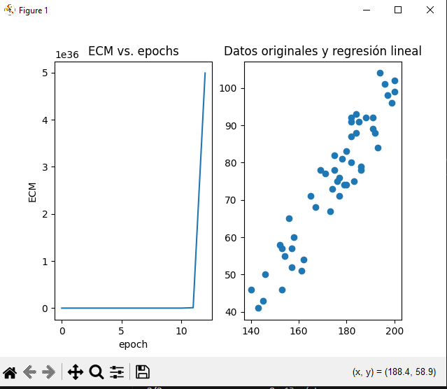
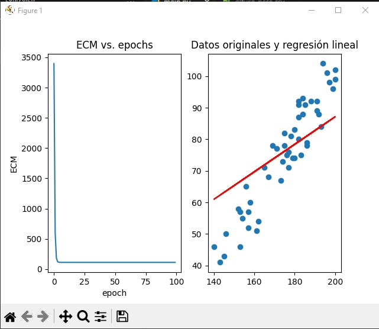

# Ejercicio Práctico con Keras

una vez clonado el repositorio, crear un entorno virtual y acceder al mismo:
```bash
virtualenv venv
```
```bash
source .\venv\Scripts\activate
```
Instalar las dependencias:
```bash
pip install -r requirements.txt
```

Para ejecutar el script:
```bash
python main.py
```

### Aclaración

Si bien en la actividad se especificaba que la taza de aprendizaje (learning_rate) se debía setear en 0.0004, esto ocasionaba que el modelo arrojara los siguientes resultados:  
  

Debido a esto lo cambié a 0.00001, obteniendo los siguientes resultados:  
  

En las 3 lineas finales está la predicción con una altura especifica